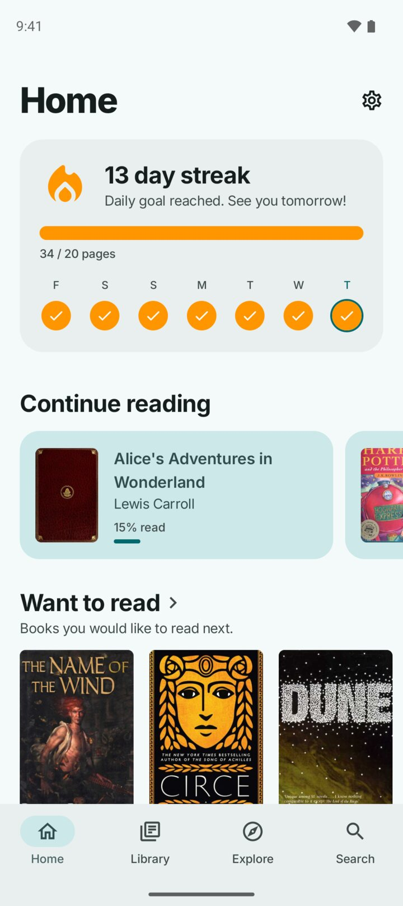
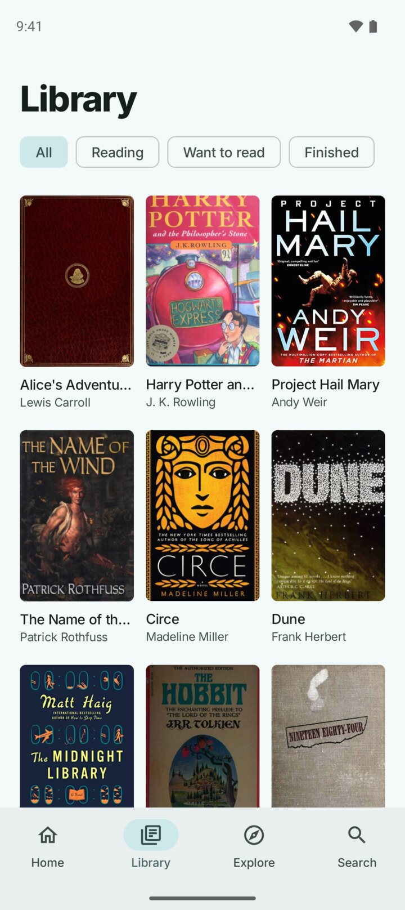
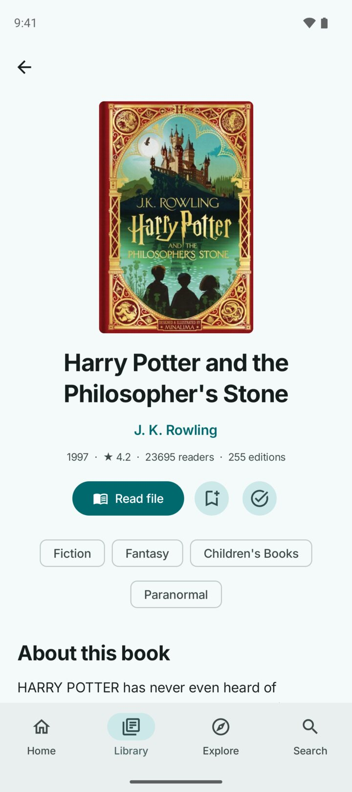
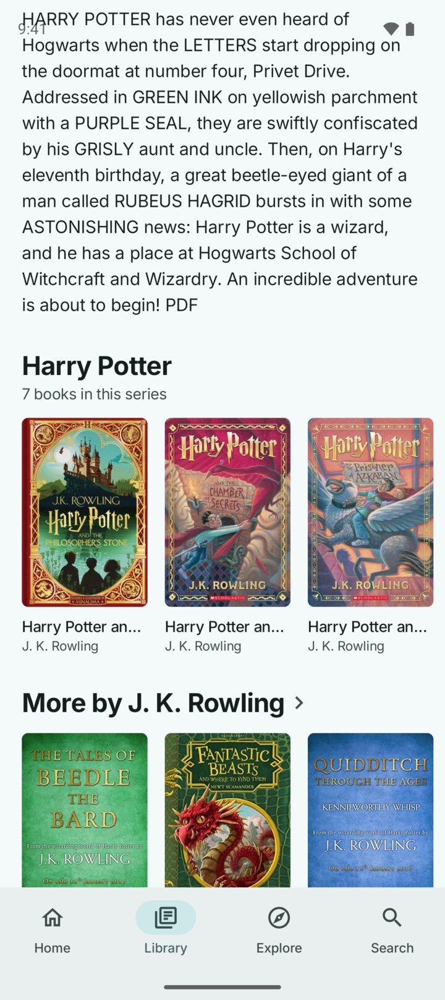

<div align="center">


# Shelf

**Offline book catalogue for Android.**
Search, explore, track reading streaks, read your own files.

[](https://github.com/tn3w/Shelf/releases/latest)
[](https://github.com/tn3w/Shelf/releases)


<a href="https://github.com/tn3w/Shelf/releases/latest/download/shelf.apk"></a>
<a href="https://apps.obtainium.imranr.dev/redirect?r=obtainium://app/%257B%2522id%2522%253A%2522dev.tn3w.shelf%2522%252C%2522url%2522%253A%2522https%253A%252F%252Fgithub.com%252Ftn3w%252FShelf%2522%252C%2522author%2522%253A%2522tn3w%2522%252C%2522name%2522%253A%2522Shelf%2522%257D"></a>

<p align="center">
<picture><source media="(prefers-color-scheme: dark)" srcset="android/design/screenshots/dark/1_home.jpg"></picture>
<picture><source media="(prefers-color-scheme: dark)" srcset="android/design/screenshots/dark/2_library.jpg"></picture>
<picture><source media="(prefers-color-scheme: dark)" srcset="android/design/screenshots/dark/3_book.jpg"></picture>
<picture><source media="(prefers-color-scheme: dark)" srcset="android/design/screenshots/dark/4_series.jpg"></picture>
<picture><source media="(prefers-color-scheme: dark)" srcset="android/design/screenshots/dark/5_explore.jpg"></picture>
<picture><source media="(prefers-color-scheme: dark)" srcset="android/design/screenshots/dark/6_reader.jpg"></picture>
</p>

</div>

Shelf is a private, offline-first Android app for browsing, discovering and reading
books. The GitHub build bundles a starter catalogue, the F-Droid build downloads one on
first launch, both fetch optional packs on request, and your library stays on device. The
catalogue is rebuilt from
[Open Library dumps](https://openlibrary.org/developers/dumps) and published as GitHub
releases.

## Overview

| App | Catalogue | Builder | Privacy |
|---|---|---|---|
| Kotlin + Jetpack Compose | English, German, French, Spanish | Rust, deterministic output | No account, trackers, Play Services or Firebase |
| Android 8+ | Core data bundled (GitHub) or fetched (F-Droid) | Monthly Open Library import | Network only for packs, updates and optional covers |
| GitHub and F-Droid flavors | Packs for genres, audiences and nonfiction | Segments, ranks and deltas | Library export/import as a zip you choose |

| Browse | Read | Track |
|---|---|---|
| Search with typo tolerance, open author and tag pages, explore popular works and genres. | Read EPUB, PDF, TXT/Markdown, HTML, FB2 and CBZ files with progress and chapters. | Keep Want, Reading and Finished shelves, daily goals, streaks and series progress. |

Author pages and author search results show Open Library author photos when online covers
are on, falling back to initials, and group works by series in reading order,
most prominent series first, with standalone titles under "Other books".

Settings → Backup writes a zip holding `library.json` (shelves, progress, activity,
dismissed recommendations, settings) plus every imported book file, through the system
file picker, and reads one back. Import merges: newest shelf entry per work wins,
on-device reading progress and activity are kept, book files already present are not
overwritten.

Home rows surface next series volumes, more from favorite authors and books related to
your library, built locally from your shelves, tags, authors and ratings, and capped so
one author or series cannot take over a page.

## Catalogue

`core` ships with the GitHub APK and is the first download in the F-Droid build;
`fantasy`, `scifi`, `mystery`, `romance`, `kids`,
`young-adult`, `nonfiction` and `general` download on demand, alongside a shared `ranks`
file of popularity and search statistics. Each work belongs to one pack. Small packs merge
into `core` for smaller languages. Installed packs are memory-mapped, merged with monthly
deltas, and searched entirely on device.

Works, editions, authors, ratings, reading logs and covers stream into the builder; GitHub
publishes segments, ranks, translation bins, state and `manifest.json`; the app checks the
manifest, downloads what is missing, verifies SHA-256 and swaps files in atomically. Small
pack updates download quietly, larger rebases appear in Settings, and no background
service runs.

Catalogue format 2 is the only format the app reads. Anything else is refused, a stored
format 1 manifest is dropped, and a downloaded segment that no longer opens is deleted on
the next load, so a device upgrading from format 1 clears itself and refetches.
`app/build.gradle.kts` pins the bundled release in `catalogueRelease` and checks the
manifest format before bundling.

### Cover Selection

Every edition cover is vetted while editions stream in; one winner per work and language
is scored in the catalogue pass.

| Stage | Rule |
|---|---|
| Reject | Non-book formats (audio, CD, DVD, video, ebook, braille, microform, games), titles marked as audiobook, movie tie-in or disc release, and print-on-demand reprinters. |
| Reject | Images that are not an upright front cover: aspect outside `0.58–0.72`, or under 250 px wide. |
| Image points | Cover upload year (2024+ scores 70, down to 15 for 2013), stored resolution (1000 px scores 45, down to 12 for 320 px), bonus for the common trim (`0.62–0.68`). |
| Localize | Winner must be an edition in the shelf language with a latin, non-foreign title; English is the fallback, the work cover the last resort. |
| Score | Image points plus publisher reach (up to 25), edition year (10 from 1990, 5 from 1960) and a title match. |

Publisher artwork is uploaded recently and at high resolution, so upload date and stored
resolution stand in for design quality, which the dumps never state. The edition's own age
barely counts: a 1974 cover scanned at 431 px can beat a 2022 reprint thumbnail.

## Install

[GitHub releases](https://github.com/tn3w/Shelf/releases/latest) carry one `shelf.apk`
(stable URL) and one `shelf-fdroid.apk`, both listed in `SHA256SUMS`; the `github` flavor
can check for updates and install them through Android's package installer. F-Droid builds
the `fdroid` flavor from source without the updater and verifies the result against
`shelf-fdroid.apk` (`Binaries:` plus `AllowedAPKSigningKeys:` with the release key's
SHA-256, `3e2d6f28…`), so both APKs must stay signed with that one keystore and every
`Builds:` entry pins a full commit hash, never a tag; recipe in
`android/fdroid/dev.tn3w.shelf.yml`, store metadata (descriptions,
screenshots, icon, changelogs) in `android/app/fastlane/`, where fdroidserver finds it
next to the recipe's `subdir: android/app`. That build ships no catalogue: onboarding
names the core download and its size, and nothing is fetched until it is confirmed.

## Build

```sh
cd android
./gradlew assembleGithubDebug assembleFdroidRelease lint
```

`downloadCatalogue` fetches bundled catalogue files from `catalogueRelease` and verifies
them against its manifest; it runs for the `github` flavor only, so the `fdroid` APK ships
no catalogue and builds from source alone. Release builds are unsigned unless
`KEYSTORE_FILE` is set.

```sh
cd builder
cargo build --release
target/release/builder <dumps-source> <out-dir> [--previous <dir>] [--rebase] \
  [--month YYYY-MM-DD[-N]] [--translations <dir>] [--requests <dir>] \
  [--translator <command>]
```

The builder streams dumps from Open Library or reads local files, and writes the current
release only: segments, ranks, state and manifest. Previous state lets monthly builds
publish small deltas instead of full replacements.

## Translations

`tooling/translate.py` fills missing German, French and Spanish descriptions from English
requests, reuses previous output, and writes `translations-<lang>.bin`. The app labels
those descriptions as *Machine translated*.

```sh
python tooling/translate.py requests/requests-de.jsonl out/translations-de.bin \
  --language de --previous previous/translations-de.bin
```

With `--translator "python tooling/translate.py <flags>"` the builder runs it per language
right after exporting requests, appending the requests file, output file, `--language` and
`--previous`, then rebuilds descriptions from the fresh output in the same pass.

## Database Workflow

| Step | What happens |
|---|---|
| Schedule | Runs monthly, on relevant builder changes, or by manual dispatch. |
| Inputs | Downloads previous state and translations in parallel with the newest dumps. |
| Build | One builder pass: requests → translation via `--translator` → segments, ranks, manifest. |
| Publish | Creates the `catalogue-<label>` release with all output files. |
| Prune | Deletes catalogue releases no longer referenced by the new manifest, tags included. |

Unchanged packs keep their old release URL in the manifest, so a release is deleted only
once nothing points at it.

## Project Map

| Path | Role |
|---|---|
| `android/` | App, flavors, UI, reader, local library and catalogue loading. |
| `builder/` | Rust catalogue builder, scoring, packs, tags, segment encoding and manifests. |
| `tooling/` | Emulator screenshots and the machine-translation helper. |
| `.github/workflows/` | Monthly catalogue builds and app releases. |

| App source | Role |
|---|---|
| `data/Segment.kt` | Reads segment and rank files. |
| `data/Catalogue.kt` | Merges packs, exposes works, authors, tags and series. |
| `data/Search.kt` | Search candidates, fuzzy terms, completions and ranking. |
| `data/Recommend.kt` | Home recommendations and discovery rows. |
| `data/Packs.kt` | Manifest refresh, downloads and installed-pack state. |
| `data/Library.kt` | Shelves, progress, streaks, settings and zip backup. |
| `data/Documents.kt` | Reader document parsing. |
| `ui/*` | Compose screens, theme and shared components. |
