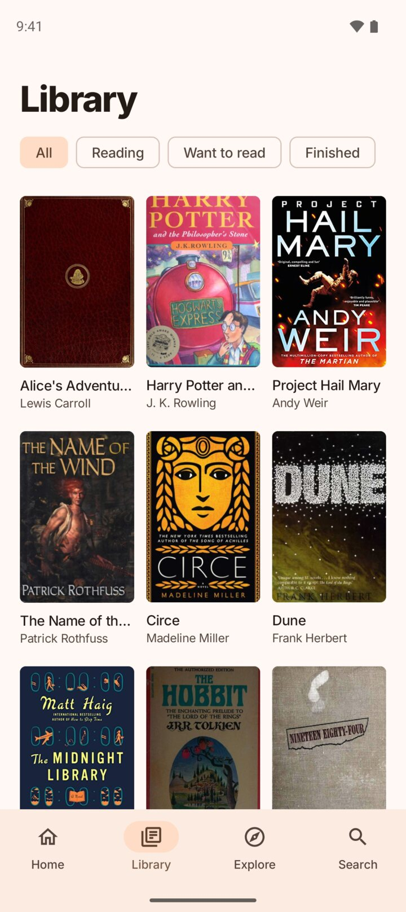
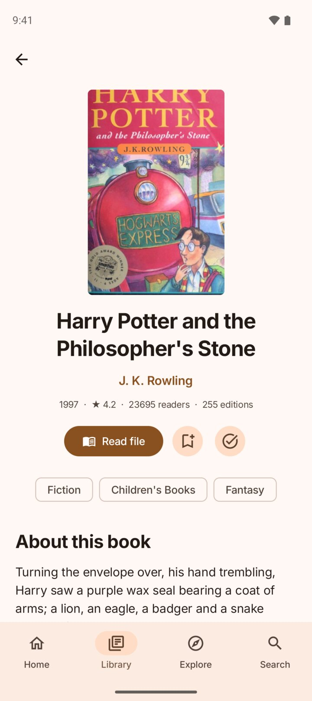
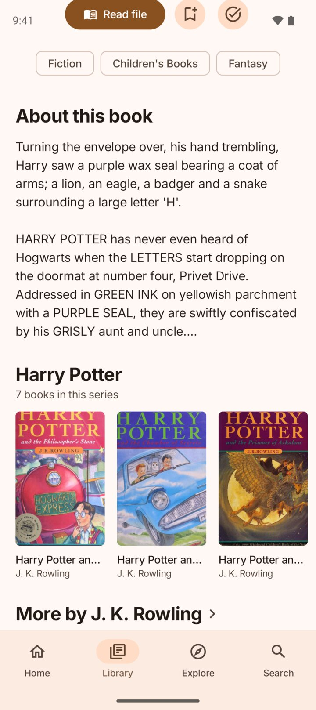
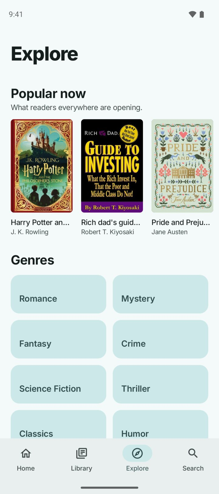
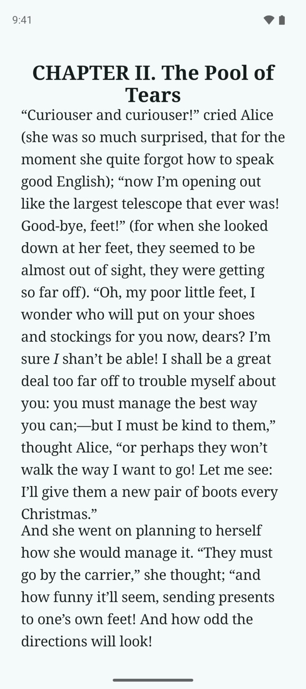

<div align="center">


# Shelf

**Offline book catalogue for Android.**
Search, explore, track reading streaks, read your own files.

[](https://github.com/tn3w/Shelf/releases/latest)
[](https://github.com/tn3w/Shelf/releases)


<a href="https://github.com/tn3w/Shelf/releases/latest/download/shelf.apk"></a>
<a href="https://apps.obtainium.imranr.dev/redirect?r=obtainium://app/%257B%2522id%2522%253A%2522dev.tn3w.shelf%2522%252C%2522url%2522%253A%2522https%253A%252F%252Fgithub.com%252Ftn3w%252FShelf%2522%252C%2522author%2522%253A%2522tn3w%2522%252C%2522name%2522%253A%2522Shelf%2522%257D"></a>

<p align="center">
<picture><source media="(prefers-color-scheme: dark)" srcset="android/design/screenshots/dark/1_home.jpg"></picture>
<picture><source media="(prefers-color-scheme: dark)" srcset="android/design/screenshots/dark/2_library.jpg"></picture>
<picture><source media="(prefers-color-scheme: dark)" srcset="android/design/screenshots/dark/3_book.jpg"></picture>
<picture><source media="(prefers-color-scheme: dark)" srcset="android/design/screenshots/dark/4_series.jpg"></picture>
<picture><source media="(prefers-color-scheme: dark)" srcset="android/design/screenshots/dark/5_explore.jpg"></picture>
<picture><source media="(prefers-color-scheme: dark)" srcset="android/design/screenshots/dark/6_reader.jpg"></picture>
</p>

</div>

Shelf is a private, offline-first Android app for browsing, discovering and reading books.
It bundles a starter catalogue, downloads optional packs, and keeps your library on
device. The catalogue is rebuilt from
[Open Library dumps](https://openlibrary.org/developers/dumps) and published as GitHub
releases.

## Overview

| App | Catalogue | Builder | Privacy |
|---|---|---|---|
| Kotlin + Jetpack Compose | English, German, French, Spanish | Rust, deterministic output | No account, trackers, Play Services or Firebase |
| Android 8+ | Core data bundled in the APK | Monthly Open Library import | Network only for packs, updates and optional covers |
| GitHub and F-Droid flavors | Packs for genres, audiences and nonfiction | Segments, ranks and deltas | Library backup stays in app DataStore |

## Experience

| Browse | Read | Track |
|---|---|---|
| Search with typo tolerance, open author and tag pages, explore popular works and genres. | Read EPUB, PDF, TXT/Markdown, HTML, FB2 and CBZ files with progress and chapters. | Keep Want, Reading and Finished shelves, daily goals, streaks and series progress. |

| Discover | Personalize | Stay Offline |
|---|---|---|
| Home rows surface next series volumes, more from favorite authors and books related to your library. | Pick book language, packs, app language, theme, covers and update behavior. | Core works without setup; downloaded packs are verified and stored locally. |

## Catalogue

| Layer | Purpose |
|---|---|
| `core` | Compact starter set bundled with the APK. |
| Genre packs | `fantasy`, `scifi`, `mystery`, `romance`. |
| Audience packs | `kids`, `young-adult`. |
| General packs | `nonfiction`, `general`. |
| Ranks | Popularity and search statistics shared by installed packs. |

Each work belongs to one pack. Small packs can be merged into `core` for smaller
languages, while English can use the full split. Installed packs are memory-mapped,
merged with monthly deltas, and searched entirely on device.

## Data Pipeline

| Open Library dumps | Catalogue release | Android app |
|---|---|---|
| Works, editions, authors, ratings, reading logs and covers stream into the builder. | GitHub publishes segment files, rank files, translation bins, state and `manifest.json`. | The app checks the manifest, downloads missing files, verifies SHA-256 and swaps them in atomically. |

Small installed-pack updates can download quietly; larger rebases appear in Settings. The
app does not run a background service.

### Cover Selection

Every edition cover is vetted while editions stream in, then one winner per work and
language is scored in the catalogue pass.

| Stage | Rule |
|---|---|
| Reject | Non-book formats (audio, CD, DVD, video, ebook, braille, microform, games) and edition titles marked as audiobook, movie tie-in or disc releases. |
| Reject | Images that are not an upright front cover: aspect outside `0.58–0.72`, or under 250 px wide. |
| Image points | Cover upload year (2024+ scores 70, down to 15 for 2013), stored resolution (1000 px scores 45, down to 12 for 320 px) and a bonus for the common trim (`0.62–0.68`). |
| Localize | Winner must be an edition in the shelf language with a latin, non-foreign title; English is the fallback, the work cover the last resort. |
| Score | Image points plus publisher reach (up to 25), edition year (10 from 1990, 5 from 1960) and a title match. |

Publisher-supplied artwork is uploaded recently and at high resolution, so cover upload
date and stored resolution stand in for design quality, which the dumps never state. The
edition's own age barely counts: a 1974 cover scanned at 431 px can beat a 2022 reprint
thumbnail. Print-on-demand reprinters stay excluded throughout.

## Discovery

Recommendations run locally over your shelves and installed catalogue data.

| Signal | Use |
|---|---|
| Shelves and reading progress | Build a lightweight taste profile. |
| Tags, authors, series and audience | Retrieve books that fit the profile without mixing incompatible rows. |
| Popularity and ratings | Keep results useful when several candidates match. |
| Diversity rules | Avoid repeating the same author, series or already-saved work. |

Explore and genre pages use the same catalogue ranking, capped so one author or series
does not take over a page.

## Install

| Source | File |
|---|---|
| [GitHub release](https://github.com/tn3w/Shelf/releases/latest) | One `shelf.apk` (stable URL) with `SHA256SUMS`. |
| F-Droid | Builds the `fdroid` flavor from source (no updater); recipe in `android/fdroid/dev.tn3w.shelf.yml`, metadata in `android/fastlane/`. |

The GitHub flavor can check for app updates and install them through Android's package
installer. That updater is hidden for F-Droid-style installs.

## Build

```sh
cd android
./gradlew assembleGithubDebug assembleFdroidRelease lint
```

`downloadCatalogue` fetches bundled catalogue files from the configured
`catalogueRelease` and verifies them against its manifest. Release builds are unsigned
unless `KEYSTORE_FILE` is set.

## Project Map

| Path | Role |
|---|---|
| `android/` | Android app, flavors, UI, reader, local library and catalogue loading. |
| `builder/` | Rust catalogue builder, scoring, packs, tags, segment encoding and manifests. |
| `tooling/screenshots.py` | Emulator-driven screenshots for Fastlane and this README. |
| `tooling/translate.py` | Optional machine-translation helper for missing descriptions. |
| `.github/workflows/` | Monthly catalogue builds and app releases. |

## Key App Sources

| File | Role |
|---|---|
| `data/Segment.kt` | Reads segment and rank files. |
| `data/Catalogue.kt` | Merges packs, exposes works, authors, tags and series. |
| `data/Search.kt` | Search candidates, fuzzy terms, completions and ranking. |
| `data/Recommend.kt` | Home recommendations and discovery rows. |
| `data/Packs.kt` | Manifest refresh, downloads and installed-pack state. |
| `data/Library.kt` | Shelves, progress, streaks and settings. |
| `data/Documents.kt` | Reader document parsing. |
| `ui/*` | Compose screens, theme and shared components. |

## Builder

```sh
cd builder
cargo build --release
target/release/builder <dumps-source> <out-dir> [--previous <dir>] [--rebase] \
  [--month YYYY-MM-DD[-N]] [--translations <dir>] [--requests <dir>] \
  [--translator <command>]
```

The builder can stream dumps from Open Library or read local dump files. It writes the
current release files only: catalogue segments, ranks, state and manifest. Previous state
lets monthly builds publish small deltas instead of full replacements.

## Translations

`tooling/translate.py` fills missing German, French and Spanish descriptions from English
requests, reuses previous output, and writes `translations-<lang>.bin`. The app labels
those descriptions as *Machine translated*.

```sh
python tooling/translate.py requests/requests-de.jsonl out/translations-de.bin \
  --language de --previous previous/translations-de.bin
```

With `--translator "python tooling/translate.py <flags>"` the builder runs it itself per
language, right after exporting requests, and rebuilds descriptions from the fresh
output. The dumps are parsed once; requests, translation and segments happen in a single
builder pass. The builder appends the requests file, output file, `--language` and
`--previous`.

## Database Workflow

| Step | What happens |
|---|---|
| Schedule | Runs monthly, on relevant builder changes, or by manual dispatch. |
| Inputs | Downloads previous state and translations in parallel with the newest dumps. |
| Build | One builder pass: requests → translation via `--translator` → segments, ranks, manifest. |
| Publish | Creates the `catalogue-<label>` release with all output files. |
| Prune | Deletes catalogue releases no longer referenced by the new manifest, tags included. |

Unchanged packs keep their old release URL in the manifest, so a release is deleted only
once nothing points at it. Old `db-YYYY-MM` releases are kept for older APKs that only
know that naming scheme.
