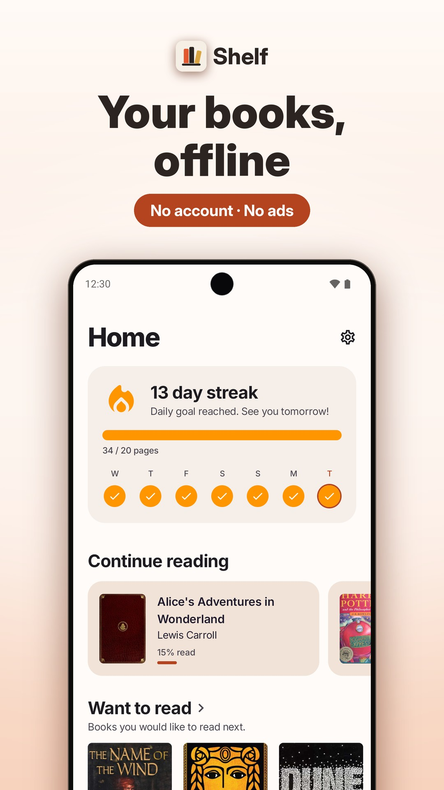
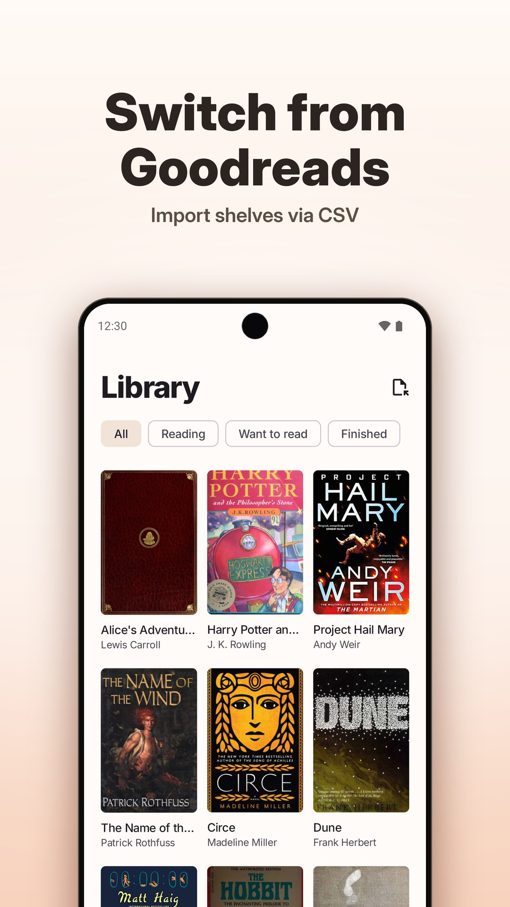
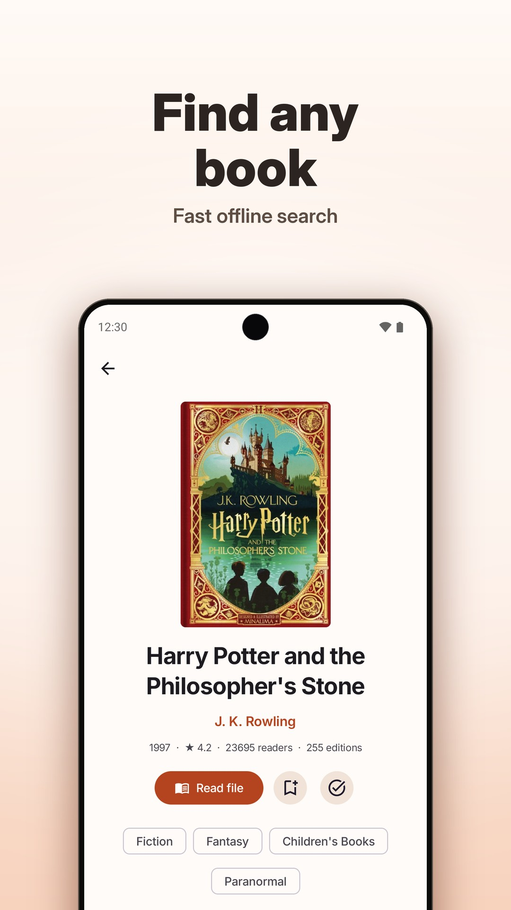
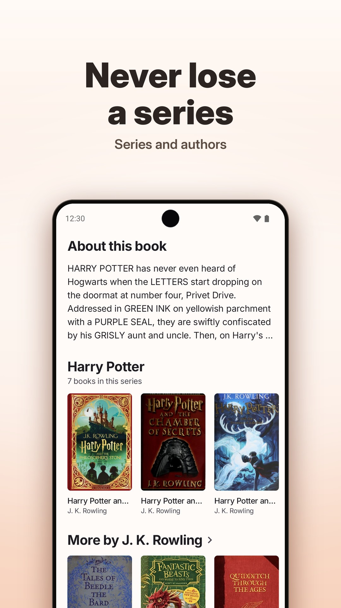
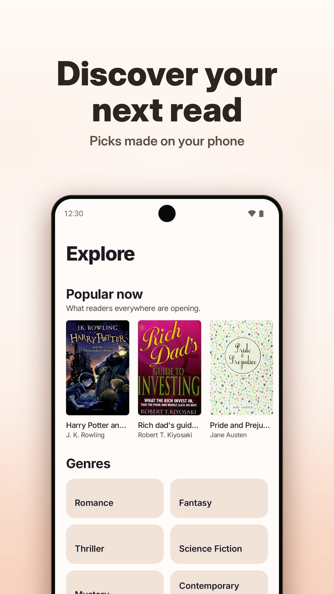
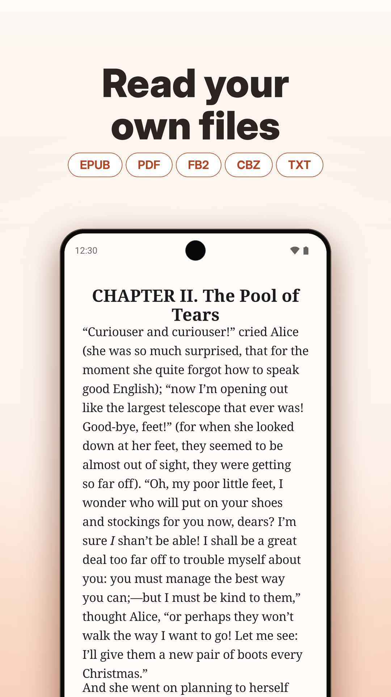

<div align="center">


# Shelf

**Offline book catalogue for Android.**
Search, explore, track reading streaks, read your own files.

[](https://github.com/tn3w/Shelf/releases/latest)
[](https://github.com/tn3w/Shelf/releases)
[](https://www.android.com)
[](https://kotlinlang.org)
[](https://developer.android.com/compose)

<a href="https://github.com/tn3w/Shelf/releases/latest/download/shelf.apk"></a>
<a href="https://apps.obtainium.imranr.dev/redirect?r=obtainium://app/%257B%2522id%2522%253A%2522dev.tn3w.shelf%2522%252C%2522url%2522%253A%2522https%253A%252F%252Fgithub.com%252Ftn3w%252FShelf%2522%252C%2522author%2522%253A%2522tn3w%2522%252C%2522name%2522%253A%2522Shelf%2522%257D"></a>
<a href="https://f-droid.org/packages/dev.tn3w.shelf/"></a>

https://github.com/user-attachments/assets/5ffe8161-7070-4fbc-8a89-836da15b2b37

<p align="center">
<picture><source media="(prefers-color-scheme: dark)" srcset="android/design/screenshots/dark/1_home.jpg"></picture>
<picture><source media="(prefers-color-scheme: dark)" srcset="android/design/screenshots/dark/2_library.jpg"></picture>
<picture><source media="(prefers-color-scheme: dark)" srcset="android/design/screenshots/dark/3_book.jpg"></picture>
<picture><source media="(prefers-color-scheme: dark)" srcset="android/design/screenshots/dark/4_series.jpg"></picture>
<picture><source media="(prefers-color-scheme: dark)" srcset="android/design/screenshots/dark/5_explore.jpg"></picture>
<picture><source media="(prefers-color-scheme: dark)" srcset="android/design/screenshots/dark/6_reader.jpg"></picture>
</p>

</div>

Shelf browses, tracks and reads books offline. The catalogue is built from
[Open Library dumps](https://openlibrary.org/developers/dumps) and published as GitHub
releases; your library never leaves the device.

| App | Catalogue | Builder |
|---|---|---|
| Kotlin + Jetpack Compose, Android 8+ | English, German, French, Spanish | Rust, deterministic output |
| GitHub and F-Droid flavors | Packs for genres, audiences and nonfiction | Monthly Open Library import |

| Browse | Read | Track |
|---|---|---|
| Search with typo tolerance, author and tag pages, popular works and genres. | EPUB, PDF, TXT/Markdown, HTML, FB2 and CBZ with progress and chapters. | Want, Reading and Finished shelves, daily goals, streaks and series progress. |

Any book file opens, catalogue or not: Library → import, *Open with* from a file manager
or *Share* to Shelf. EPUB and FB2 titles and authors come from the file, anything else
from its name; such books live in the library with a drawn cover and can be removed from
their book page (the imported copy goes, the original stays).

Home rows and author pages are built locally from your shelves, tags, authors and ratings.
Settings → Backup writes a zip (`library.json` plus imported book files) through the
system file picker and merges one back in.

## Privacy

No account, trackers, Play Services or Firebase, and no background service.

- Both APKs bundle `manifest.json`, so onboarding lists every pack and size offline.
  First launch sends no request; nothing downloads until you tap Download, and the
  monthly catalogue check starts a month after onboarding.
- Offline mode, on onboarding and in Settings, switches off app updates, catalogue
  refresh, covers and author photos. Each is also its own switch.
- Offline mode locks on when the INTERNET permission is denied, read from the permission
  state, never by probing a URL.
- Core download = `core` + `ranks` (English 7.7 MB), shown as one size. Parallel pack
  downloads fetch each file once.
- Cover and photo requests wait until settings load, so a disabled switch sends nothing,
  not even DNS. `covers.openlibrary.org` redirects to `archive.org`.
- Requests are https only and carry no identifiers or cookies, with a fixed `Shelf` user
  agent in place of the device one.
- Nothing is tied to one host: Settings → Own servers and files (also folded into
  onboarding) sets the catalogue source and cover server, or imports catalogue files.

## Catalogue

`core` ships with the GitHub APK and is the first download in the F-Droid build;
`fantasy`, `scifi`, `mystery`, `romance`, `kids`, `young-adult`, `nonfiction` and
`general` download on demand, alongside a shared `ranks` file. Each work belongs to one
pack; small packs merge into `core` for smaller languages. Installed packs are
memory-mapped, merged with monthly deltas and searched on device.

### Own servers and files

| Setting | Accepts |
|---|---|
| Catalogue source | `owner/name` on GitHub, a releases API URL (GitHub, Gitea, Forgejo), or a direct `manifest.json` URL. Empty = `tn3w/Shelf`. The manifest loads on Save, never before. |
| Cover server | Base URL serving Open Library's `/b/id/…` and `/a/olid/…` paths. Empty = `covers.openlibrary.org`. |
| Import catalogue files | Segment and ranks files named as released (`en-core-2026-09-18.bin`, `en-ranks-…`), plus an optional `manifest.json`. Each must open as a format-2 segment or ranks file. |

Onboarding closes by itself once one language has both `core` and `ranks`, switching to
that language if needed; otherwise it says which file is missing. Without any catalogue
(e.g. *Continue offline* in the F-Droid build), Home and Explore say so and link to Settings. Self-hosting: run the
builder with `--base-url https://host/path` and serve `catalogue-<label>/<file>` below
it, or point the source at a releases API carrying the same assets.

The app verifies SHA-256 and swaps files in atomically. Small pack updates download
quietly, larger rebases appear in Settings. Format 2 is the only format read: anything
else is refused, and a segment that no longer opens is deleted on the next load.

### Cover selection

One winner per work and language, scored while editions stream in.

| Stage | Rule |
|---|---|
| Reject | Non-book formats (audio, CD, DVD, video, ebook, braille, microform, games), audiobook, movie tie-in or disc titles, print-on-demand reprinters. |
| Reject | Not an upright front cover: aspect outside `0.58–0.72`, or under 250 px wide. |
| Image points | Upload year (2024+ scores 70, down to 15 for 2013), stored resolution (1000 px scores 45, down to 12 for 320 px), bonus for the common trim (`0.62–0.68`). |
| Localize | An edition in the shelf language with a latin title; English is the fallback, the work cover the last resort. |
| Score | Image points plus publisher reach (up to 25), edition year (10 from 1990, 5 from 1960) and a title match. |

Upload date and resolution stand in for design quality, which the dumps never state, so a
1974 cover scanned at 431 px can beat a 2022 reprint thumbnail.

## Install

[Releases](https://github.com/tn3w/Shelf/releases/latest) carry `shelf.apk` and
`shelf-fdroid.apk`, both listed in `SHA256SUMS`. The `github` flavor can update itself
through Android's package installer; F-Droid builds the `fdroid` flavor from source
without the updater and verifies it against `shelf-fdroid.apk`, so both APKs must stay
signed with the one keystore, native libraries keep their debug symbols so builds with
and without an NDK match byte for byte, and every `Builds:` entry pins a full commit
hash. Recipe in [fdroiddata](https://gitlab.com/fdroid/fdroiddata/-/blob/master/metadata/dev.tn3w.shelf.yml), updated automatically per `v*` tag; store metadata in
`android/app/fastlane/`.

## Build

```sh
cd android
./gradlew assembleGithubDebug assembleFdroidRelease lint
```

`downloadCatalogue` fetches the bundled files pinned by `catalogueRelease` and verifies
them against its manifest; the `fdroid` flavor runs `downloadManifest`, taking that same
manifest and no segments. Release builds are unsigned unless `KEYSTORE_FILE` is set.

```sh
cd builder
cargo build --release
target/release/builder <dumps-source> <out-dir> [--previous <dir>] [--rebase] \
  [--month YYYY-MM-DD[-N]] [--translations <dir>] [--requests <dir>] \
  [--translator <command>] [--base-url <url>]
```

The builder streams dumps or reads local files and writes one release: segments, ranks,
state and manifest. Previous state turns monthly builds into small deltas. Manifest URLs
are `<base-url>/catalogue-<label>/<file>`, by default the GitHub release download path.

`tooling/translate.py` fills missing descriptions in all four languages, which the app
labels *Machine translated*. Every non-empty description not written in the target
language is translated. The builder detects the source (en, de, fr, es, pt, it, nl) and
sends it as `source_language`; descriptions with an undetected language are skipped. The
default `nllb-200-3.3B` takes the source per sentence; `--model` also accepts Opus-MT
models, which ignore it. With `--translator "python tooling/translate.py <flags>"` the builder runs it
per language and rebuilds descriptions in the same pass.

```sh
python tooling/translate.py requests/requests-de.jsonl out/translations-de.bin \
  --language de --previous previous/translations-de.bin
```

The monthly workflow downloads previous state and the newest dumps, runs one builder pass,
publishes a `catalogue-<label>` release and deletes catalogue releases the new manifest no
longer points at.

## Generated covers

<p align="center">
<picture><source media="(prefers-color-scheme: dark)" srcset="android/design/covers-dark.jpg"></picture>
</p>

Books without a cover get one drawn on device from `Canvas` shaders and system fonts.
Tags pick one of 19 genres, then a `work|title|author` seed picks one of 72 styles and its
colours, so a cover never changes. Text is scrimmed until legible; results are cached.

## Project map

| Path | Role |
|---|---|
| `android/` | App, flavors, UI, reader, local library and catalogue loading. |
| `builder/` | Rust catalogue builder, scoring, packs, tags, segment encoding and manifests. |
| `tooling/` | Emulator screenshots and machine translation. |
| `.github/workflows/` | CI on pull requests, monthly catalogue builds, app releases. |
| `data/Segment.kt`, `data/Catalogue.kt` | Segment and rank files; merged works, authors, tags and series. |
| `data/Search.kt`, `data/Recommend.kt` | Search candidates and ranking; home and discovery rows. |
| `data/Packs.kt`, `data/Library.kt` | Manifest, downloads and pack state; shelves, progress, settings and backup. |
| `data/Documents.kt`, `ui/*` | Reader document parsing; Compose screens, theme and components. |
| `cover/`, `cover/art/*` | Seeded cover generator: palette, type, legibility; the art directions. |

## Contributing

Issues, translations and pull requests are welcome, and forking is encouraged: MIT, so
build your own Shelf if you want. Start with [CONTRIBUTING.md](CONTRIBUTING.md); every
pull request runs the app and builder checks in CI. Vulnerabilities go through
[SECURITY.md](SECURITY.md), conduct through
[CODE_OF_CONDUCT.md](CODE_OF_CONDUCT.md).

## License

MIT, see [LICENSE](LICENSE). Catalogue data comes from
[Open Library](https://openlibrary.org), dedicated to the public domain.
