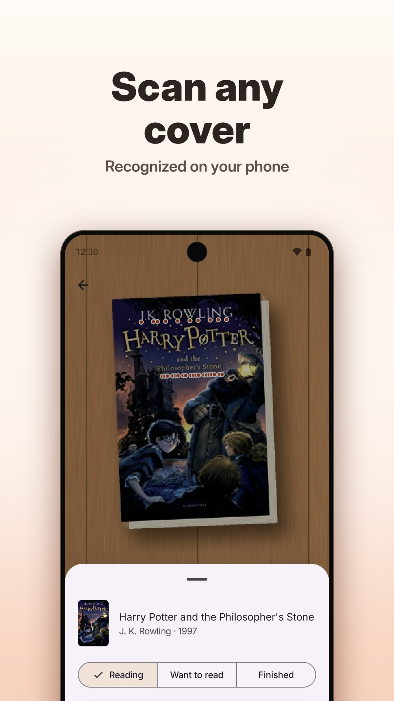
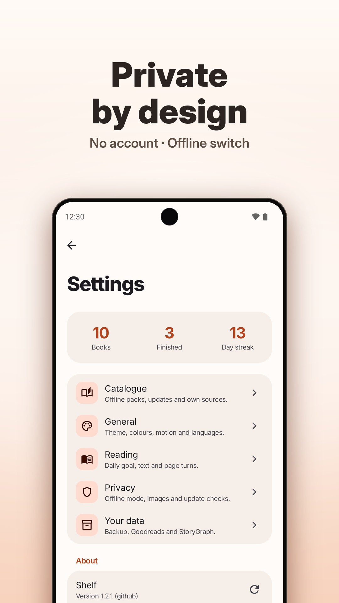
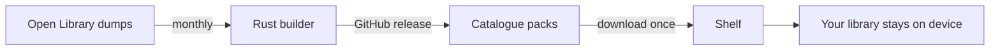

<div align="center">


# Shelf

**Offline book catalogue for Android.**
Search, explore, track reading streaks, read your own files.

[](https://github.com/tn3w/Shelf/releases/latest)
[](https://github.com/tn3w/Shelf/releases)
[](https://www.android.com)
[](https://kotlinlang.org)
[](https://developer.android.com/compose)

<a href="https://github.com/tn3w/Shelf/releases/latest/download/shelf.apk"></a>
<a href="https://apps.obtainium.imranr.dev/redirect?r=obtainium://app/%257B%2522id%2522%253A%2522dev.tn3w.shelf%2522%252C%2522url%2522%253A%2522https%253A%252F%252Fgithub.com%252Ftn3w%252FShelf%2522%252C%2522author%2522%253A%2522tn3w%2522%252C%2522name%2522%253A%2522Shelf%2522%257D"></a>
<a href="https://f-droid.org/packages/dev.tn3w.shelf/"></a>

<p align="center">
<picture><source media="(prefers-color-scheme: dark)" srcset="android/design/screenshots/dark/1_home.jpg"></picture>
<picture><source media="(prefers-color-scheme: dark)" srcset="android/design/screenshots/dark/2_library.jpg"></picture>
<picture><source media="(prefers-color-scheme: dark)" srcset="android/design/screenshots/dark/3_book.jpg"></picture>
<picture><source media="(prefers-color-scheme: dark)" srcset="android/design/screenshots/dark/4_series.jpg"></picture>
<br>
<picture><source media="(prefers-color-scheme: dark)" srcset="android/design/screenshots/dark/5_explore.jpg"></picture>
<picture><source media="(prefers-color-scheme: dark)" srcset="android/design/screenshots/dark/6_reader.jpg"></picture>
<picture><source media="(prefers-color-scheme: dark)" srcset="android/design/screenshots/dark/7_scan.jpg"></picture>
<picture><source media="(prefers-color-scheme: dark)" srcset="android/design/screenshots/dark/8_settings.jpg"></picture>
</p>

https://github.com/user-attachments/assets/5ffe8161-7070-4fbc-8a89-836da15b2b37

</div>

## Features

<table>
<tr><th width="1%">Find</th><th width="1%">Read</th><th width="1%">Track</th></tr>
<tr><td align="center">Typo-tolerant search, cover scanner</td><td align="center">EPUB · PDF · FB2 · CBZ · TXT · HTML</td><td align="center">Want · Reading · Finished</td></tr>
<tr><td align="center">Genres, series, authors</td><td align="center">Paper and night pages</td><td align="center">Daily goal and streaks</td></tr>
<tr><td align="center">Recommendations on device</td><td align="center">Volume and page keys</td><td align="center">Goodreads / StoryGraph import</td></tr>
</table>

## How it works


```mermaid
flowchart LR
    A[Open Library dumps] -->|monthly| B[Rust builder]
    B -->|GitHub release| C[Catalogue packs]
    C -->|download once| D[Shelf]
    D --> E[Your library stays on device]
```

## Privacy

<table>
<tr><th width="1%">What</th><th width="1%">Shelf</th></tr>
<tr><td>Accounts, trackers, ads</td><td><b>none</b></td></tr>
<tr><td>First launch</td><td><b>no request</b></td></tr>
<tr><td>Offline mode</td><td><b>one switch</b> cuts all network</td></tr>
<tr><td>Cover scanner</td><td><b>on device</b>, no request, frames never stored</td></tr>
<tr><td>Requests</td><td>https only, no identifiers, no cookies</td></tr>
<tr><td>Hosts</td><td>GitHub, Open Library, or <b>your own server</b></td></tr>
</table>

## Own books

Book missing from the catalogue? Library › **+**, or search it and tap
**Add "…" as own book**. Title, author and shelf stay on device. Cover drawn on device,
or tap it, in the sheet or on the book page, to pick your own image.
Library › file icon imports an EPUB, PDF, FB2, CBZ, TXT or HTML file instead. Same file
twice → same book. Imported files and own covers move along on device transfer; cloud
backup keeps the library only, so re-import files there.

## Scan a cover

Search › scan icon (hidden without camera). Hold a cover in view: frames are matched
live against the **selected catalogue**; clear leader → vibration, frozen frame with
dots on the read title, sheet with book, shelf picker, **Scan again**. Tap → capture
with a lower threshold. ISBN barcodes (EAN-13, QR) are read with ZXing and looked up in
every installed catalogue.

On device, pure Kotlin, no network:

- `data/Lines.kt`: 1280×960 grayscale, deskew, edge-based line finding, 48 px crops
- `data/Recognizer.kt`: CNN for `assets/scan.bin` (PP-OCRv6 tiny, Apache-2.0,
  300 Latin characters, 1.2 MB), exact parity with the reference
- `data/Scan.kt`: orientation, best 6 of 8 lines, typo- and glued-word-tolerant
  title/author matching, stop rule over decaying scores

`scan.bin`: `SCAN`, version 3, line height, alphabet, layers (grouped/strided conv,
8/16-bit weights, squeeze-excite, pool). Export script and bench data: gitignored
`scanbench/`.

## Switch from Goodreads or StoryGraph

```
Export CSV  →  Settings › Your data › Import CSV  →  done
```

Shelves, ratings and read dates carry over. Books match by ISBN, then title and author.
Books not in the catalogue become your own.
Export writes the same format back.

## Catalogue

<table>
<tr><th width="1%">Type</th><th width="1%">Contents</th></tr>
<tr><td>Languages</td><td>English · Deutsch · Français · Español</td></tr>
<tr><td>Genre packs</td><td>fantasy · scifi · mystery · romance</td></tr>
<tr><td>More packs</td><td>kids · young-adult · nonfiction · general</td></tr>
</table>

`core` ships in the APK. Other packs download on demand, verified by SHA-256.
Packs include ISBNs of editions in their language; older apps ignore them.

## Generated covers

<p align="center">
<picture><source media="(prefers-color-scheme: dark)" srcset="android/design/covers-dark.jpg"></picture>
</p>

Books without a cover get one drawn on device. Same book, same cover. Art style follows
genre from catalogue tags, also for saved books.

Every design follows one minimal system: flat colors, one motif, no textures or frames.
Title on top in serif, sans or condensed. Author in small caps at the bottom.

## Build

```sh
cd android
./gradlew assembleGithubDebug
./gradlew testGithubDebugUnitTest testFdroidDebugUnitTest
./gradlew assembleGithubRelease -PlocalCatalogue=<builder out dir>
```

```sh
cd builder && cargo build --release
target/release/builder <dumps> <out> [--previous <dir>] [--base-url <url>]
```

Format with `ktlint -F "android/app/src/**/*.kt"`.

Store screenshots (root AVD `shelf-screenshots` or `SHELF_AVD`, app installed, `ffmpeg`):
`python3 tooling/screenshots.py [--only 7_scan|8_settings]`. Scan shot: emulator camera
plays a rendered book-on-table loop; taps to capture after 30 s.

Scanner bench (local `scanbench/cache` clips; `--tune` grid-searches the stop rule):

```sh
cd android
./gradlew scanBench --args="bench tune [--reuse] [--tune]"
```

## Project

<table>
<tr><th width="1%">Path</th><th width="1%">Role</th></tr>
<tr><td><code>android/</code></td><td>App</td></tr>
<tr><td><code>builder/</code></td><td>Catalogue builder</td></tr>
<tr><td><code>tooling/</code></td><td>Screenshots, translation, promo</td></tr>
</table>

[Contributing](CONTRIBUTING.md) · [Security](SECURITY.md) ·
[Code of conduct](CODE_OF_CONDUCT.md) · [MIT License](LICENSE) ·
Data from [Open Library](https://openlibrary.org)
